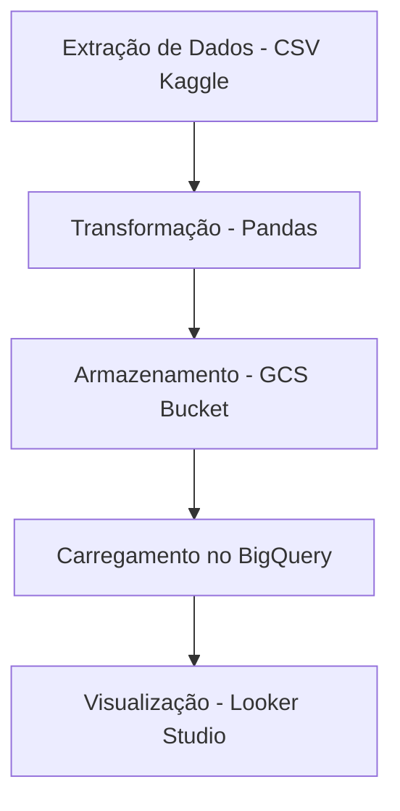

# Projeto DataGirls - Análise de Rotatividade de Funcionários

## 1. Visão Geral
Este projeto foi desenvolvido como parte do **bootcamp DataGirls** e tem como objetivo realizar a extração, transformação e carregamento (ETL) de dados relacionados à rotatividade de funcionários (dataset **IBM HR Analytics - Employee Attrition & Performance**), disponibilizando-os para análise em um dashboard no **Looker Studio**.

O pipeline foi implementado utilizando **Python**, **Apache Airflow** (via Docker) e **Google Cloud Platform** (GCS e BigQuery).

Dashboard disponível em: [Acessar Dashboard](https://lookerstudio.google.com/reporting/4c51f089-1699-4ecb-bb05-adedb49ba6d5)

---

## 2. Arquitetura do Pipeline



- **Extração:** Download do dataset original (formato CSV).
- **Transformação:** Limpeza, padronização, tradução de colunas e valores categóricos.
- **Armazenamento:** Upload do arquivo processado (`.parquet`) para o Google Cloud Storage.
- **Carga:** Importação do `.parquet` para uma tabela no BigQuery.
- **Visualização:** Criação de dashboards interativos no Looker Studio.

---

## 3. Tecnologias Utilizadas

- **Linguagem:** Python 3.10
- **Bibliotecas:** pandas, google-cloud-storage
- **Orquestração:** Apache Airflow 2.7.2
- **Infraestrutura:** Docker + docker-compose
- **Nuvem:** Google Cloud Platform (GCS, BigQuery, Looker Studio)

---

## 4. Execução Local

### 4.1 Pré-requisitos
- Python 3.10+
- Docker e Docker Compose
- Conta no Google Cloud com permissões para GCS e BigQuery
- Credenciais JSON da conta de serviço do GCP

### 4.2 Passos
1. Clone este repositório
```bash
git clone https://github.com/seuusuario/seurepositorio.git
```
2. Suba o Airflow com Docker:
```bash
docker compose up -d
```
3. Coloque o arquivo CSV original em `data/raw/`
4. Execute a DAG `etl_datagirlspfinal` no Airflow

---

## 5. Transformações Realizadas

- Remoção de colunas irrelevantes: `EmployeeCount`, `Over18`, `StandardHours`, `EmployeeNumber`
- Remoção de duplicatas e valores nulos
- Tradução de colunas e valores para português
- Padronização de categorias numéricas para descritivas
- Salvamento no formato `.parquet` para otimização de carregamento

---

## 6. Perguntas Norteadoras de Negócio

1. **Como a empresa pode monitorar a rotatividade de funcionários semanalmente?**
   - Criando uma atualização agendada no pipeline para processar dados semanalmente e atualizar o dashboard automaticamente.
2. **Quais informações devem ser atualizadas em tempo real ou periodicamente?**
   - Rotatividade, salário mensal, satisfação no trabalho e indicadores de performance.
3. **Como garantir que os dados estejam prontos para análises de forma confiável?**
   - Utilizando processos automatizados de ETL e validação de dados antes do carregamento.
4. **É possível criar um modelo incremental com essa base?**
   - Sim, adaptando o ETL para ingestão apenas de novos registros.

---

## 7. Autoria
Projeto desenvolvido por **Marcela** durante o bootcamp **DataGirls**.
